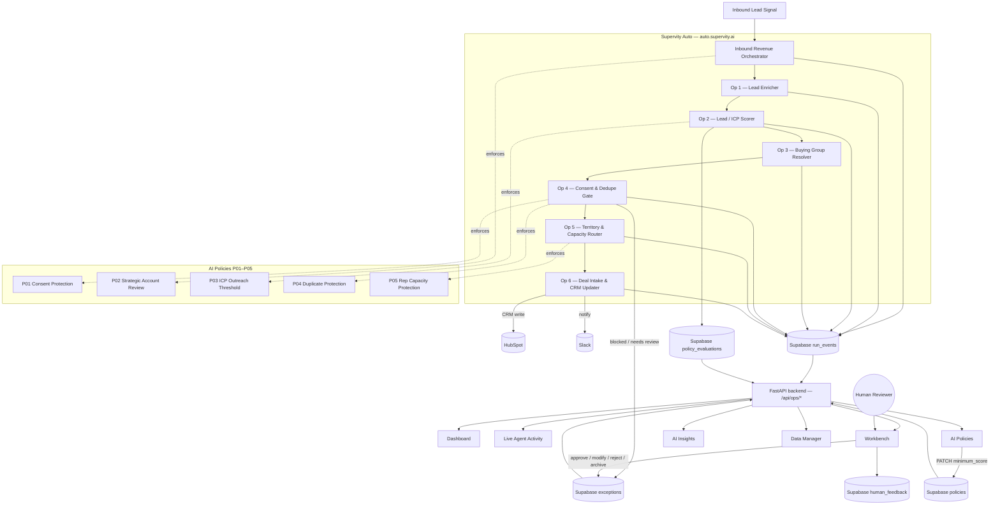

# 🚀 AutoPilot Sales Command Center

**An AI Employee for inbound revenue — one Orchestrator and six Operators that enrich, score, govern, route, and close every lead, with humans in the loop for everything the AI shouldn't decide alone.**

Built for **AutoPilot Hackathon — Asia, Round 2** (Track 1: Sales Command Center).

---

## Table of Contents

- [The Problem](#the-problem-sales-intelligence-at-scale)
- [The Solution](#the-solution)
- [Architecture](#architecture)
  - [1 Orchestrator + 6 Operators](#1-orchestrator--6-operators)
  - [The Shared RevenueCase](#the-shared-revenuecase)
- [AI Policies (P01–P05)](#ai-policies-p01p05)
  - [Live Policy Hot-Swap](#live-policy-hot-swap)
- [Workbench — Human-in-the-Loop](#workbench--human-in-the-loop)
- [AI Insights](#ai-insights)
- [Command Center](#command-center)
- [Integrations](#integrations)
- [Architecture Flow Diagram](#architecture-flow-diagram)
- [Screenshots](#screenshots)
- [Technology Stack](#technology-stack)
- [Prerequisites](#prerequisites)
- [Environment Variables](#environment-variables)
- [Quick Start (Clean Clone)](#quick-start-clean-clone)
- [Docker / Make Commands](#docker--make-commands)
- [Security Note](#security-note)
- [Demo Scenario](#demo-scenario)
- [Hackathon Context](#hackathon-context)
- [Project Structure](#project-structure)
- [Troubleshooting](#troubleshooting)

---

## The Problem: Sales Intelligence at Scale

Every inbound lead sets off the same expensive, error-prone chain of manual work: figure out who the company actually is, decide if it's worth pursuing, find out who else at that company is involved, make sure outreach is even legally allowed, avoid stepping on another rep's deal, hand it to someone who has capacity for it, and get it into the CRM without breaking anything. Done by hand, this is slow, inconsistent across regions, and quietly non-compliant — a consent conflict missed here, a duplicate opportunity created there, two reps routed the same account, a rep working 140% of capacity while another sits idle.

None of these failure modes are hypothetical — they're the exact conditions this system is built to catch: **consent/DNC conflicts**, **duplicate contacts and open opportunities**, **routing-rule collisions**, **rep over-capacity**, and **strategic accounts that skip human review**. Sales Intelligence isn't about scoring leads faster — it's about running the entire intake-to-CRM pipeline autonomously *without ever silently doing the wrong thing*, and knowing exactly when to stop and ask a human.

## The Solution

The AutoPilot Sales Command Center is a multi-agent "AI Employee" — one **Orchestrator** and six **Operators**, built and executed on **[Auto by Supervity](https://auto.supervity.ai)** — that runs every inbound lead through enrichment, ICP scoring, buying-group resolution, consent/dedupe checks, capacity-aware routing, and CRM write-back. Every step is constrained by five **AI Policies (P01–P05)** evaluated at runtime, every blocked or ambiguous case lands in a **Workbench** for a human decision, and every execution is visible in a live **Command Center**: real-time KPIs, per-operator activity, evidence-backed **AI Insights**, and a policy console where a threshold change takes effect on the *next* automated run — no redeploy.

This backend does not fabricate anything for the demo. Every number on every page — KPIs, agent activity, insight cards, integration status — is computed live from rows Supervity has actually written to Supabase. Where the system doesn't have direct confirmation of something (e.g. whether a Slack message actually delivered), it says so explicitly instead of showing a fake green checkmark.

---

## Architecture

### 1 Orchestrator + 6 Operators

All agents run on **Auto by Supervity**. The **Inbound Revenue Orchestrator** receives the trigger for each lead and delegates, in order, to six specialist Operators. The FastAPI backend never re-implements this logic — it only reads the telemetry Supervity writes to Supabase's `run_events` table and renders it.

| # | Operator | Responsibility | Enforces |
|---|----------|-----------------|----------|
| — | **Inbound Revenue Orchestrator** | Receives the inbound trigger, sequences the six Operators, and carries the run's overall governance decision (allow / hold for review / suppress). | P02 |
| 1 | **Lead Enricher** | Resolves firmographic data (company domain, industry, size) ahead of scoring. Sourced from `enrichment_data` — this Operator has no dedicated `run_events` stream in current telemetry, so the Command Center labels its activity as *source records*, never fabricated event counts. | — |
| 2 | **Lead / ICP Scorer** *("Sales Lead Scorer & Intelligence Brief Generator")* | Scores the lead against the Ideal Customer Profile, tags it (e.g. `HOT`), and writes the `LEAD_SCORED` event that everything downstream — the dashboard, Insights, and the P03 Impact Preview — reads from. | P03 |
| 3 | **Buying Group Resolver** | Links multiple stakeholders at the same account into a `buying_group`, tagging roles (e.g. `economic_buyer`) so outreach can be multi-threaded instead of single-contact. | — |
| 4 | **Consent & Dedupe Gate** | The compliance and data-quality checkpoint: blocks outreach on invalid/withdrawn/conflicting consent, and flags duplicate contacts or accounts with more than one open opportunity. | P01, P04 |
| 5 | **Territory & Capacity Router** | Selects the owning rep from `routing_rules` + `sdr_roster`, refusing to route to inactive or over-capacity reps, and surfaces routing-rule collisions (two rules, same region/segment/industry/priority, different owners). | P05 |
| 6 | **Deal Intake & CRM Updater** | The write boundary: creates/updates the HubSpot deal, and is the qualifying trigger for the post-write Slack notification. If upstream policies didn't clear the lead, this Operator performs **no write** rather than writing partial data. | — |

### The Shared RevenueCase

A single lead's journey rarely stays inside one `run_id` — scoring, buying-group resolution, consent, routing, and the CRM write are frequently separate Supervity runs for the same account, arriving minutes apart. Grouping strictly by `run_id` fragments one real sales-pipeline execution into disconnected pieces.

Instead, the backend (`app/services/ops_runs.py::correlate_business_timelines`) builds what we call a **RevenueCase**: every `run_events` row and every P03 `policy_evaluations` row for the same `account_id` is merged chronologically into one continuous timeline, split into a new case only when the gap since the previous event exceeds 5 minutes (chosen from observed data — real operator handoffs land under ~4 minutes apart; distinct executions are 7+ minutes apart). Each RevenueCase gets a stable id, `BIZ-{account_id}-{started_at}`, a `final_status` derived from the most severe status seen (`SUPPRESSED` > `HUMAN_REVIEW` > `PAUSED_OR_NO_WRITE` > `COMPLETED`), and the full ordered event + policy-evaluation stream. This is what renders as each timeline card on **Live Agent Activity** (`/ai/agents`) — the true, correlated story of what happened to one lead, not a raw event dump.

---

## AI Policies (P01–P05)

Policies live in Supabase's `policies` table and are evaluated by the Operators at runtime — editing one takes effect on the *next* Supervity run, with no code change or redeploy. These are the five active policies in this deployment:

| ID | Name | Type | Enforced by | What it does |
|----|------|------|-------------|---------------|
| **P01** | Consent Protection | `compliance` | Consent & Dedupe Gate | Blocks outreach on opt-out, do-not-call, or conflicting regional consent records. |
| **P02** | Strategic Account Human Review | `governance` | Inbound Revenue Orchestrator | Strategic accounts require a human decision before any material CRM or outreach action. |
| **P03** | ICP Outreach Threshold | `scoring` | Lead / ICP Scorer | Only leads at or above the live `minimum_score` may proceed autonomously — the flagship, most-frequently-tuned policy. |
| **P04** | Duplicate Protection | `data_quality` | Consent & Dedupe Gate | Suppresses duplicate contacts and flags accounts with more than one open opportunity for review. |
| **P05** | Rep Capacity Protection | `routing` | Territory & Capacity Router | Blocks new assignments to inactive reps or reps already at/over capacity. |

Every evaluation (pass, block, or hold) is recorded in `policy_evaluations` with the evidence that produced it, and every policy-caused block is fully auditable from the Workbench.

### Live Policy Hot-Swap

P03 is the deliberate showcase for this: change the threshold, and the very next lead scored by Supervity is judged against the new number — nothing to redeploy.

```bash
# 1) See the current live value
curl http://localhost:8001/api/ops/policies/P03

# 2) Preview the impact BEFORE committing — how many currently-scored leads
#    would newly pass or get suppressed at a candidate threshold
curl "http://localhost:8001/api/ops/policies/P03/impact?minimum_score=75"

# 3) Commit the change — shallow-merges into the existing config, so only
#    minimum_score changes; nothing else on the policy is touched
curl -X PATCH http://localhost:8001/api/ops/policies/P03 \
  -H "Content-Type: application/json" \
  -d '{"config": {"minimum_score": 75}}'
```

The same flow is available in the UI at **AI Policies → P03 → Impact Preview → Save** — drag the candidate threshold, see exactly which real leads would flip from suppressed to eligible (or vice versa) using every distinct ICP score Supervity has actually recorded, then commit. The next Lead / ICP Scorer run picks it up immediately.

---

## Workbench — Human-in-the-Loop

Anything the Operators can't safely decide — a consent conflict, a duplicate-opportunity ambiguity, a routing collision, a strategic account awaiting P02 review — lands as a row in Supabase's `exceptions` table and surfaces in **Workbench** (`/workbench`). Each exception carries the evidence and the specific policy decisions that triggered it (`triggered_policies`, normalized from the raw evidence payload), so a reviewer sees *why* the AI stopped, not just *that* it stopped.

A human resolves it with one of four decisions:

- **Approve** — accept the AI's proposed action
- **Modify** — override with a correction
- **Reject** — decline the action outright
- **Archive** — clear a stale/technical artifact that was never a real business decision

Every decision writes back to `exceptions` (status, `human_decision`, `human_comment`, `resolved_at`) **and** inserts an auditable row into `human_feedback` — the resolution is never silently applied; it's a permanent record that can inform future runs.

---

## AI Insights

Insights (`/ai/insights`) are computed live, not generated by an LLM guessing at patterns — every card cites the exact rows that produced it. The backend currently derives seven insight types from `run_events`, `exceptions`, `routing_rules`, `sdr_roster`, `buying_group`, and `policies`:

| Insight | Signal |
|---|---|
| High-intent buying group detected | 2+ stakeholders linked to the same `buying_group` |
| Consent region conflict | Pending `CONSENT_REGION_CONFLICT` exception |
| Routing collision | Two `routing_rules` sharing region/segment/industry/priority but different owners |
| Rep over/near capacity | `sdr_roster.current_capacity` at or above `max_capacity` (or ≥90%) |
| Duplicate open-opportunity risk | Pending exception with >1 `open_opportunity_ids` |
| Suppression-rate trend | % of correlated runs ending `SUPPRESSED`, annotated with the live P03 threshold |
| Pending exception backlog | Count and priority mix of unresolved Workbench items |

Cards are ranked `critical` → `warning` → `info` and each ships with a `confidence` score, the raw `evidence`, and a concrete `recommendation` — never generic filler.

---

## Command Center

The Next.js frontend is the single pane of glass over everything above:

| Page | Route | What it shows |
|---|---|---|
| **Dashboard** | `/` | Live KPIs (leads processed, policy blocks, pending reviews, buying groups detected, CRM actions, routing collisions), recent RevenueCases, and the latest operation with its P03 pass/fail against the *current* live threshold. |
| **Live Agent Activity** | `/ai/agents` | Per-Operator status cards + the correlated RevenueCase timelines described above. |
| **AI Policies** | `/ai/policies` | All 5 policies, with the P03 hero panel driving the hot-swap + Impact Preview flow. |
| **Workbench** | `/workbench` | The human-in-the-loop exception queue. |
| **AI Insights** | `/ai/insights` | The evidence-backed insight cards above. |
| **Data Manager** | `/data-manager` | Integration health for Supabase, Supervity Auto, HubSpot, and Slack (see below). |
| **AI Manager** | header button | Chat-style entry point for interacting with the agent ecosystem. |
| **Settings / Admin** | `/settings`, `/admin/*` | User, role, and audit administration inherited from the base template (auth, audit log viewer, session management). |

---

## Integrations

| System | Role | Where it's configured |
|---|---|---|
| **Supervity Auto** | Runs the Orchestrator + all 6 Operators. This is the *only* place agent orchestration logic lives, per the hackathon's mandatory platform requirement. | Workflow/operator definitions live entirely on [auto.supervity.ai](https://auto.supervity.ai); this repo only reads the telemetry it writes to Supabase. |
| **Supabase** | System of record for everything operational: `run_events`, `policies`, `policy_evaluations`, `exceptions`, `human_feedback`, `routing_rules`, `sdr_roster`, `buying_group`, `enrichment_data`, `account`. Queried backend-only via `app/core/supabase_client.py`. | `SUPABASE_URL`, `SUPABASE_SECRET_KEY` (backend env only) |
| **HubSpot** | CRM system of action. The Deal Intake & CRM Updater Operator creates/updates deals directly from the Supervity workflow. This backend never talks to HubSpot's API itself — it only reads back the `hubspot_deal_id` Supervity recorded in `run_events`. | Configured inside the Supervity Auto workflow, not in this repo |
| **Slack** | Post-CRM-write notification. Because `run_events` carries no dedicated Slack telemetry field, the Data Manager page reports this honestly as *"inferred from workflow design, not confirmed"* rather than a fabricated green status. | Configured inside the Supervity Auto workflow, not in this repo |

Note the asymmetry is intentional: **Supabase gets a real, direct health check** (`GET /rest/v1/policies` with latency measurement) because this backend talks to it directly. **Supervity Auto, HubSpot, and Slack do not** — the Data Manager page is explicit that their status is *"last observed activity"*, derived from telemetry, never a simulated live probe.

---

## Architecture Flow Diagram



---

## Screenshots

> Screenshots are not yet committed to this repository. Capture and drop PNGs into `docs/screenshots/` before final submission, then replace the placeholders below with real `` links.

| Page | Placeholder |
|---|---|
| Dashboard | `docs/screenshots/dashboard.png` |
| Live Agent Activity | `docs/screenshots/agent-activity.png` |
| AI Policies — P03 hot-swap + Impact Preview | `docs/screenshots/policies-p03.png` |
| Workbench | `docs/screenshots/workbench.png` |
| AI Insights | `docs/screenshots/insights.png` |
| Data Manager | `docs/screenshots/data-manager.png` |

---

## Technology Stack

| Layer | Technology | Purpose |
|-------|------------|---------|
| **Agent Orchestration** | [Auto by Supervity](https://auto.supervity.ai) | Orchestrator + 6 Operators — the entire multi-agent runtime |
| **Backend** | Python 3.11 + FastAPI | `/api/ops/*` read/write surface over Supabase |
| **Operational Data** | Supabase (PostgREST) | `run_events`, `policies`, `exceptions`, `human_feedback`, and related tables |
| **Frontend** | Next.js 15 + React 19 | Command Center UI |
| **App Database** | PostgreSQL 15 + SQLAlchemy 2 + Alembic | Auth, audit log, and template scaffolding (separate from Supabase) |
| **Auth** | NextAuth.js + JWT | Session management (`AUTH_BYPASS` for local dev) |
| **UI** | Tailwind CSS + Framer Motion | Styling + animation |
| **Containers** | Docker + Docker Compose | One-command local startup |
| **CRM** | HubSpot | Deal creation/update, written by the Deal Intake & CRM Updater Operator |
| **Notifications** | Slack | Post-CRM-write alerting |

---

## Prerequisites

| Tool | macOS | Windows | Why you need it |
|------|-------|---------|-----------------|
| **Docker Desktop** | [Download](https://www.docker.com/products/docker-desktop/) | [Download](https://www.docker.com/products/docker-desktop/) | Runs backend, frontend, and database in containers |
| **Git** | Pre-installed or `brew install git` | [Download](https://git-scm.com/download/win) or `winget install Git.Git` | Clone the repository |

> **Windows users:** Enable WSL 2 (Docker Desktop will prompt you). If you hit a WSL error, run `wsl --install` in PowerShell as Administrator and restart.

To see **live** operational data (KPIs, agent activity, policies, insights) rather than empty/"not configured" states, you also need:
- A **Supabase** project with the operational schema (`run_events`, `policies`, `exceptions`, `human_feedback`, `routing_rules`, `sdr_roster`, `buying_group`, `enrichment_data`, `account`, `policy_evaluations`) and its URL + service-role secret key.
- A **Supervity Auto** workspace running the Orchestrator + 6 Operators against that same Supabase project.

Without these, the app still starts and runs — the Sales Command Center pages will honestly report "Supabase is not configured" instead of showing fabricated data.

---

## Environment Variables

All variables are documented, name-only, in [`.env.example`](.env.example) — copy it to `.env` and fill in real values locally. **Never commit `.env`.**

| Variable | Required | Description |
|---|---|---|
| `APP_ENV` | No (default `development`) | Backend runtime mode |
| `FRONTEND_URL` | No | Allowed CORS origin for the frontend |
| `LOG_LEVEL` | No | Backend log verbosity |
| `AUTH_BYPASS` | No (default `true`) | Skips auth in local dev — all requests run as a Dev User |
| `POSTGRES_USER` / `POSTGRES_PASSWORD` / `POSTGRES_DB` / `POSTGRES_HOST` / `POSTGRES_PORT` | No | Local Postgres container (auth/audit/items — **not** the Sales Command Center data) |
| `DATABASE_URL` | No | Composed from the `POSTGRES_*` values above |
| `SUPABASE_URL` | **Yes, for live data** | Your Supabase project REST URL — backend-only |
| `SUPABASE_SECRET_KEY` | **Yes, for live data** | Supabase service-role key — backend-only, never sent to the frontend |
| `SUPERVITY_API_KEY` | Optional | Supervity Auto API credential, if your backend calls Auto directly |
| `SUPERVITY_ORG_KEY` | Optional | Supervity organization key |
| `SUPERVITY_WORKFLOW_ID` | Optional | The workflow ID for the Sales Command Center agent ecosystem on Auto |
| `NODE_ENV` | No | Frontend runtime mode |
| `NEXT_PUBLIC_API_URL` | Yes | Base URL the frontend uses to call the backend |
| `NEXT_PUBLIC_BASE_PATH` | No | Optional subpath mount |
| `NEXTAUTH_URL` | Yes | NextAuth callback base URL |
| `NEXTAUTH_SECRET` | Yes | Signs/encrypts NextAuth session tokens — generate with `openssl rand -base64 32` |
| `FRONTEND_TARGET` | No (default `dev`) | `dev` for hot reload, `prod` for optimized build |

When `SUPABASE_URL` / `SUPABASE_SECRET_KEY` are unset, every `/api/ops/*` endpoint returns a `503` with a clear "Supabase is not configured" message instead of guessing — verified directly in `app/core/supabase_client.py`.

---

## Quick Start (Clean Clone)

Every command below was run end-to-end against this exact repository — clone → env → `make up` → health check → live API calls — immediately before publishing this README.

### 1. Clone

```bash
git clone <your-repo-url>
cd AutoPilot-Template
```

### 2. Configure environment

```bash
cp .env.example .env
```

Open `.env` and fill in `SUPABASE_URL` / `SUPABASE_SECRET_KEY` (and the `SUPERVITY_*` values if your backend calls Auto directly) to see live data. The rest of the defaults work out of the box — `AUTH_BYPASS=true` means no auth setup is required locally.

**Windows (PowerShell):** `Copy-Item .env.example .env`
**Windows (Command Prompt):** `copy .env.example .env`

### 3. Start Docker Desktop

Open Docker Desktop and wait until it reports "running." First launch can take a minute or two.

### 4. Build and start everything

```bash
make up
```

Windows without `make`: `docker compose up --build -d` (or run `.\scripts\start.ps1`, which also clears a known WSL2 port-conflict issue on Windows — see [Troubleshooting](#troubleshooting)).

First run takes a few minutes to pull images and build containers.

### 5. Verify

```bash
docker compose ps
```

All three services should show `running`/`healthy`:

```
NAME                              STATUS
autopilot-template-postgres-1     running (healthy)
autopilot-template-backend-1      running (healthy)
autopilot-template-frontend-1     running (healthy)
```

```bash
curl http://localhost:8001/api/health
# {"status":"ok"}
```

### 6. Open it

| Service | URL |
|---|---|
| 🖥️ Command Center | http://localhost:3001 |
| ⚙️ API Docs (Swagger) | http://localhost:8001/api/docs |
| 🗄️ Postgres | `localhost:5432` (user/password from `.env`) |

If `SUPABASE_URL`/`SUPABASE_SECRET_KEY` are set, confirm live data is flowing:

```bash
curl http://localhost:8001/api/ops/policies      # the 5 active policies, P01–P05
curl http://localhost:8001/api/ops/overview      # live KPIs
curl http://localhost:8001/api/ops/integrations  # Supabase/Supervity/HubSpot/Slack status
```

---

## Docker / Make Commands

### macOS / Linux

| Command | What it does |
|---|---|
| `make up` | Build and start all services |
| `make down` | Stop all services |
| `make logs-be` / `make logs-fe` | Stream backend / frontend logs |
| `make reset-db` | Reset **local Postgres** (auth/items scaffolding) and re-seed sample data — does **not** touch Supabase |
| `make migrate-create MSG='...'` / `make migrate-up` / `make migrate-down` / `make migrate-history` | Alembic migrations for the local Postgres schema |
| `make lint` / `make format` | Lint / format backend + frontend |
| `make test-be` | Run backend pytest suite |
| `make help` | Show all commands |

### Windows (`docker compose` directly)

| Command | What it does |
|---|---|
| `docker compose up --build -d` | Build and start all services |
| `docker compose down` | Stop all services |
| `docker compose logs -f backend` / `frontend` | Stream logs |
| `docker compose exec backend python scripts/reset_db.py && docker compose exec backend python scripts/seed_db.py` | Reset local Postgres |
| `docker compose exec backend alembic upgrade head` | Apply migrations |
| `docker compose exec backend pytest` | Run backend tests |

Restart without rebuilding: `docker compose up -d`. Full clean reset (drops local volumes): `make down && docker volume rm autopilot-template_postgres_data autopilot-template_document_storage && make up`.

---

## Security Note

**All secrets are backend-only. Nothing that can write to Supabase, HubSpot, or Slack, and nothing that authenticates to Supervity, is ever shipped to the browser.**

- `SUPABASE_SECRET_KEY` is read once via `os.getenv()` in `app/core/supabase_client.py` and attached to server-side `httpx` requests only. It never appears in an API response, a frontend bundle, or a `NEXT_PUBLIC_*` variable.
- Only variables explicitly prefixed `NEXT_PUBLIC_*` (e.g. `NEXT_PUBLIC_API_URL`) are ever exposed to client-side JavaScript — this is a Next.js build-time guarantee, not a convention we're trusting by hand.
- HubSpot and Slack credentials aren't in this repository at all — they're configured inside the Supervity Auto workflow definitions on auto.supervity.ai, entirely outside this codebase's trust boundary.
- `.env` is listed in `.gitignore` and was confirmed never committed in this repository's git history. `.env.example` ships with variable **names only** — every value is blank or a clearly-labeled placeholder.
- Before publishing, this repository was audited end-to-end: `git status`/`git diff --cached` for staged secrets, `git log --all` for any historical `.env` commits, and a pattern scan (API keys, JWTs, Slack/HubSpot token formats, AWS keys) across every tracked and new file. Nothing was found.

If you fork this repo, treat `SUPABASE_SECRET_KEY` with the same care as a database root password — it has full read/write access to every operational table.

---

## Demo Scenario

A live end-to-end walkthrough, using the real API surface (no mocked steps):

1. **Trigger** — A new inbound lead reaches the Inbound Revenue Orchestrator on Auto.
2. **Enrich** — Lead Enricher resolves firmographic data.
3. **Score** — Lead / ICP Scorer writes a `LEAD_SCORED` event and a P03 `policy_evaluations` row.
4. **Resolve** — Buying Group Resolver links any other stakeholders at the account.
5. **Govern** — Consent & Dedupe Gate checks P01 (consent) and P04 (duplicates); a violation creates a Workbench exception instead of proceeding.
6. **Route** — Territory & Capacity Router checks P05 and assigns an owning rep, or surfaces a routing collision.
7. **Write** — Deal Intake & CRM Updater creates/updates the HubSpot deal — only if every upstream policy cleared — and its success is the qualifying trigger for the Slack notification.
8. **Observe** — Open the Dashboard: KPIs and the new RevenueCase appear immediately, reflecting exactly what Supervity wrote.
9. **Intervene** — If step 5 or 6 raised an exception, resolve it in Workbench (approve/modify/reject) and watch the audit trail land in `human_feedback`.
10. **Tune** — Open AI Policies → P03, run an Impact Preview against a candidate `minimum_score`, and commit it — the very next lead scored is judged against the new threshold, live.

**A real execution observed in this deployment** (captured while testing this README, shown as a concrete illustration — your own run will differ): a lead for *Sunrise Logistics Co.* scored `80.6` against a P03 threshold of `30`, passed, was routed to rep *Mei Chen*, and produced HubSpot deal `340531686132` — end to end, with zero manual steps, fully traceable through `/api/ops/overview`.

---

## Hackathon Context

This submission targets **AutoPilot Hackathon — Asia, Round 2, Track 1 (Sales Command Center)**, built against the mandatory platform requirement that all Orchestrator and Operator agents run on **[Auto by Supervity](https://auto.supervity.ai)** (see [`docs/hackathon-brief.md`](docs/hackathon-brief.md)). Everything else — the policy engine, exception/Workbench flow, insight generation, and the Command Center UI — is custom backend and frontend built on top of the AutoPilot template, per the brief's judging criteria:

| Criteria | Weight | Where to look |
|---|---|---|
| Agent Architecture | 25% | [1 Orchestrator + 6 Operators](#1-orchestrator--6-operators) |
| Policy Engine | 20% | [AI Policies (P01–P05)](#ai-policies-p01p05), live hot-swap |
| Exception Handling | 20% | [Workbench](#workbench--human-in-the-loop) |
| Insights & Visibility | 15% | [AI Insights](#ai-insights) |
| UI/UX & Polish | 10% | [Command Center](#command-center) |
| Innovation | 10% | The [shared RevenueCase](#the-shared-revenuecase) correlation model, honest (never fabricated) integration status |

See also [`docs/command-center-guide.md`](docs/command-center-guide.md) for the underlying Command Center architecture pattern this template is built on.

---

## Project Structure

```
AutoPilot-Template/
├── app/                          # Backend (FastAPI)
│   ├── main.py                   # App entry point, router registration
│   ├── security.py               # Auth + AUTH_BYPASS logic
│   ├── authz.py                  # Authorization engine
│   ├── core/
│   │   ├── database.py           # Local Postgres (auth/items/audit)
│   │   └── supabase_client.py    # Supabase REST client (Sales Command Center data)
│   ├── routers/
│   │   ├── ops_overview.py       # Dashboard KPIs
│   │   ├── ops_agents.py         # Live Agent Activity / RevenueCases
│   │   ├── ops_policies.py       # AI Policies + P03 Impact Preview
│   │   ├── ops_workbench.py      # Workbench exception queue
│   │   ├── ops_insights.py       # AI Insights
│   │   └── ops_data_manager.py   # Integration status (Supabase/Supervity/HubSpot/Slack)
│   └── services/ops_runs.py      # RevenueCase correlation, Operator taxonomy
├── frontend/                     # Frontend (Next.js)
│   ├── src/app/                  # Pages: dashboard, ai/*, workbench, data-manager, admin
│   ├── src/components/           # Reusable UI components
│   └── src/lib/                  # API client, utilities
├── alembic/                      # Local Postgres migrations
├── scripts/                      # Seed data, DB reset, Windows start script
├── docs/                         # hackathon-brief.md, command-center-guide.md, design system
├── docker-compose.yml
├── Dockerfile
├── Makefile
└── .env.example
```

---

## Troubleshooting

| Problem | Solution |
|---|---|
| Docker not found | Install [Docker Desktop](https://www.docker.com/products/docker-desktop/) and make sure it's running |
| Port 3001 already in use | `lsof -ti:3001 \| xargs kill` (Mac) or change the port in `docker-compose.yml` |
| Port 5432 already in use | Stop a local Postgres, or change the port in `docker-compose.yml` |
| `make` not found (Windows) | Use `docker compose` commands directly, or `choco install make` / `scoop install make` |
| WSL error (Windows) | `wsl --install` in PowerShell as Admin, then restart |
| `ERR_CONNECTION_RESET` on localhost (Windows) | WSL2's relay can intercept port 3001 via IPv6 — use `.\scripts\start.ps1`, or run `wsl --shutdown` before `docker compose up --build -d` |
| Containers crash-looping | `docker compose logs backend` — usually a missing env var or DB issue |
| `/api/ops/*` returns 503 "Supabase is not configured" | Set `SUPABASE_URL` and `SUPABASE_SECRET_KEY` in `.env` and restart the backend |
| Frontend shows blank page | Check `curl http://localhost:8001/api/health` |
| Database connection refused | Wait 10–15s after startup for Postgres to initialize |
